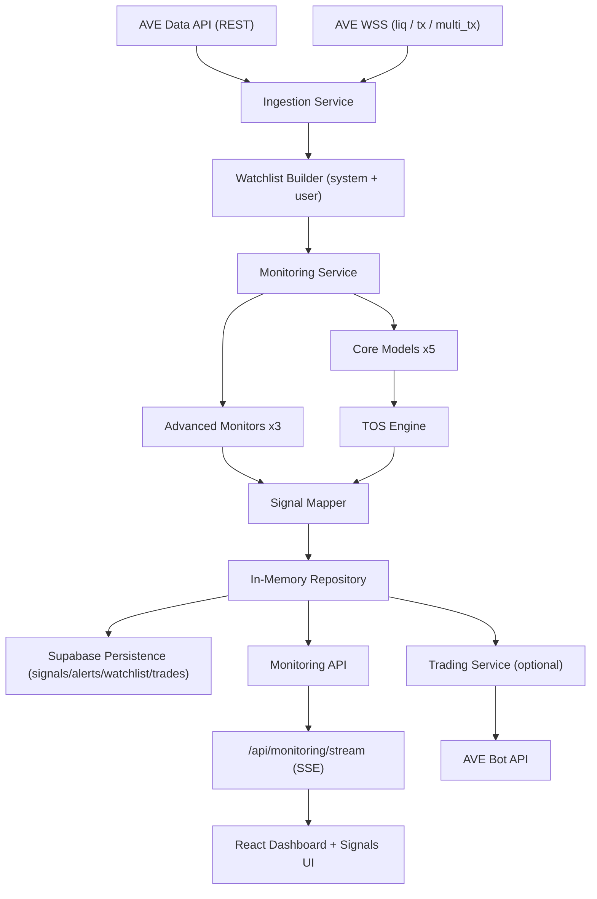

# OPIS — On-Chain Predator Intelligence System

Monitoring-first quant intelligence platform built for **AVE Claw Hackathon 2026** (Complete Application Track), using real AVE data + WSS streams to detect manipulation, risk, and opportunity in real time.

Full submission documentation:

- [Project Documentation (AVE Skills + Quant Models)](docs/PROJECT_DOCUMENTATION_AVE_CLAW_2026.md)

## AVE Claw Hackathon Context

- Event: **AVE Claw Hackathon 2026**
- Timeline: **Apr 4 – Apr 15, 2026**
- Track target: **Complete Application** (Monitoring Skill + Trading Skill)
- Product positioning: **Monitoring is primary**, execution/trading is optional and signal-driven

This project is designed to maximize judging dimensions:

- **Innovation (30%)**: 8-model on-chain intelligence stack + TOS composite layer
- **Technical Execution (30%)**: modular backend architecture, live WSS ingestion, SSE signal stream, typed frontend
- **Real-World Value (40%)**: actionable threat/opportunity monitoring with user watchlists and execution hooks

---

## What OPIS Does

OPIS continuously monitors a rotating cross-chain watchlist and user-pinned tokens, scoring each token with:

- **5 core quant models**:
  - Cabal Fingerprinter
  - DEV Drain Velocity
  - Conviction Stack
  - Narrative Radar
  - Smart Wallet DCA Accumulation
- **3 advanced monitors**:
  - Wash Trading Detector
  - Holder Retention Tracker
  - Momentum Divergence Monitor
- **TOS (Threat + Opportunity Score)** composite signal

Signals are streamed to frontend clients via `/api/monitoring/stream` (SSE), with backend ingesting live AVE WSS topics (`liq`, `tx`, `multi_tx`).

---

## Demo Highlights

- Live token search + user watchlist pinning
- WSS-driven monitoring updates (no mock fallback)
- Signal intelligence page with:
  - module filters
  - severity filters
  - TOS-specific signals
  - full-model scorecards per token
- Dashboard with:
  - live TOS feed
  - core + advanced model columns
  - alert stream
  - watchlist execution settings

---

## Architecture



### Backend Feature Boundaries

```text
backend/src/features/
  ingestion/        # WSS + watchlist refresh + event-triggered analysis
  monitoring/       # models, scoring, snapshots, signals, alerts
  trading/          # optional signal-to-execution path
  persistence/      # Supabase repositories
shared/
  clients/          # AVE data client, AVE trading client, Supabase REST client
  config/           # central env config
  logger/           # structured logging
```

---

## Monitoring Stack (Main Product)

## 1) Core Model: Cabal Fingerprinter

- Goal: detect coordinated holder clusters
- Data used:
  - `GET /v2/tokens/top100/{tokenId}`
  - `GET /v2/address/tx`
- Signal shape:
  - holder overlap
  - funding/source similarity
  - synchronized buy timing
- Output:
  - `score`, `severity`, `cluster metrics`

## 2) Core Model: DEV Drain Velocity

- Goal: detect slow-drain liquidity rug behavior
- Data used:
  - `GET /v2/txs/liq/{pairId}`
  - `GET /v2/contracts/{tokenId}`
  - `GET /v2/address/tx`
- Signal shape:
  - rolling remove-liquidity intensity
  - DEV-linked drain ratio
  - thresholding by token age, TVL, risk context

## 3) Core Model: Conviction Stack

- Goal: identify high-quality smart-money alignment (not single-wallet noise)
- Data used:
  - `GET /v2/address/smart_wallet/list`
  - `GET /v2/address/pnl`
  - `GET /v2/address/tx`
  - `GET /v2/klines/token/{tokenId}`
- Signal shape:
  - multi-wallet conviction aggregation
  - buy cadence and hold behavior

## 4) Core Model: Narrative Radar

- Goal: detect narrative acceleration and cross-chain rotation
- Data used:
  - `GET /v2/tokens/trending`
  - `GET /v2/tokens/platform`
- Signal shape:
  - narrative classifier from token metadata
  - chain-level volume acceleration tracking

## 5) Core Model: Smart Wallet DCA Accumulation

- Goal: capture repeated dip-buy accumulation patterns
- Data used:
  - `GET /v2/address/smart_wallet/list`
  - `GET /v2/address/tx`
- Signal shape:
  - frequency
  - dip buy ratio
  - accumulation consistency

## 6) Advanced Monitor: Wash Trading Detector

- Goal: detect circular/self-referential flow inflation
- Data used:
  - `GET /v2/tokens/top100/{tokenId}`
  - `GET /v2/address/tx`
- Signal shape:
  - reciprocal wallet loop counts
  - internal flow ratio vs overall activity

## 7) Advanced Monitor: Holder Retention Tracker

- Goal: compare cohort retention vs age-adjusted benchmark
- Data used:
  - `GET /v2/tokens/top100/{tokenId}`
  - `GET /v2/address/tx`
- Signal shape:
  - early cohort retention %
  - benchmark relative strength

## 8) Advanced Monitor: Momentum Divergence Monitor

- Goal: detect price-up while internal health degrades
- Data used:
  - `GET /v2/klines/token/{tokenId}`
  - `GET /v2/address/smart_wallet/list`
  - `GET /v2/address/tx`
  - `GET /v2/txs/liq/{pairId}`
- Signal shape:
  - positive price momentum
  - smart-wallet sell pressure
  - LP removal stress

## TOS Composite Engine

TOS combines the core five models:

```text
TOS =
  cabal * 0.25 +
  drain * 0.20 +
  conviction * 0.25 +
  narrative * 0.15 +
  dca * 0.15
```

- Zones:
  - `< 30`: safe
  - `30–60`: watch
  - `> 60`: act
- Polarity:
  - threat vs opportunity

Advanced monitors (`wash`, `retention`, `divergence`) are surfaced as first-class signals and score overlays for decision quality.

---

## Real-Time Flow (WSS → Signals UI)

1. Backend connects to AVE WSS and subscribes per watchlist token.
2. Incoming `liq/tx/multi_tx` events trigger selective module re-analysis.
3. MonitoringService updates snapshots, signals, and alerts.
4. SSE endpoint pushes fresh payloads:
   - `overview` (snapshots + alerts)
   - `signals` (deduped latest per token/module)
5. Frontend updates dashboard/signals in-place.

No synthetic mock data is used in normal operation.

---

## API Surface (Monitoring)

- `GET /api/monitoring/overview`
- `GET /api/monitoring/signals`
- `GET /api/monitoring/alerts`
- `GET /api/monitoring/stream` (SSE live feed)
- `GET /api/monitoring/watchlist`
- `POST /api/monitoring/watchlist`
- `GET /api/monitoring/tokens`
- `POST /api/monitoring/analyze`
- `POST /api/monitoring/run-cycle`

---

## Frontend UX

## Dashboard

- Watchlist management:
  - add/remove token
  - execution mode
  - delegate assetsId + default amounts
- Live TOS table with model columns:
  - `TOS, Cabal, Drain, Conv, Narr, DCA, Wash, Ret, Div`
- Alert stream and pending trade actions

## Signals

- Filters:
  - category (all/my/threat/opportunity)
  - severity
  - module
  - sort mode
- Signal cards:
  - module-specific metrics
  - related alerts
  - full-model scoreboard per token
  - execution controls for tradable signal modules

---

## Optional Trading Path

Trading remains connected but secondary to monitoring.

Supported flow:

1. Signal or risk gate triggers action intent.
2. Action is created with mode (`trade` or `delegate_exit`).
3. AVE Bot API path executes:
   - quote → order/tx creation → status confirmation.
4. Action/trade records persist for auditing.

This enables Complete Application track fit while keeping monitoring as the product core.

---

## Persistence

Supabase-backed repositories are used for:

- `watchlists`
- `monitoring_signals`
- `monitoring_alerts`
- `trade_actions`
- `trade_executions`

Runtime also keeps a fast in-memory repository for hot signal/alert serving.

---

## Environment

Create `.env` from `.env.example` and set:

```env
# Frontend
VITE_MONITORING_API_URL=http://localhost:4090/api/monitoring
VITE_TRADING_API_URL=http://localhost:4090/api/trading

# Backend
PORT=4090
CORS_ORIGIN=http://localhost:8080
AVE_DATA_BASE_URL=https://prod.ave-api.com
AVE_DATA_API_KEY=...
AVE_WSS_URL=wss://wss.ave-api.xyz
ENABLE_WSS_INGESTION=true
MONITORING_POLL_INTERVAL_MS=0
WATCHLIST_LIMIT=12

# Optional persistence/trading
NEXT_PUBLIC_SUPABASE_URL=...
NEXT_PUBLIC_SUPABASE_PUBLISHABLE_KEY=...
AVE_BOT_BASE_URL=https://bot-api.ave.ai
AVE_BOT_API_KEY=...
AVE_BOT_API_SECRET=...
```

---

## Run Locally

Install:

```bash
npm install
```

Start backend:

```bash
npm run server:dev
```

Start frontend:

```bash
npm run dev
```

URLs:

- Frontend: `http://localhost:8080`
- Backend health: `http://localhost:4090/health`

---

## Validation Commands

```bash
npm run typecheck:backend
npx tsc -p tsconfig.app.json --noEmit
npm run test
npm run build
```

---

## Hackathon Submission Checklist

Include the following when submitting:

- GitHub repository URL
- Project documentation (this README + architecture + AVE integration mapping)
- Demo video (<= 5 minutes)
- Optional live demo readiness:
  - running app
  - watchlist add flow
  - live signal generation
  - model score interpretation

Suggested demo script:

1. Show live WSS ingestion and watchlist setup.
2. Explain 8-model monitoring stack + TOS composition.
3. Trigger/analyze a token and inspect signal card + scoreboard.
4. Show threat vs opportunity interpretation in UI.
5. (Optional) Show execution handoff to trading module.

---

## Why This Is Real-World Useful

- Detects manipulation patterns early (cabal, drain, wash, divergence).
- Improves signal quality with multi-model confirmation.
- Gives analysts and traders explainable scoring, not black-box entries.
- Can run as a standalone monitoring intelligence layer or execution-enabled system.

---

## Contact

Hackathon contact from event page: `sephana@ave.ai`

If you are reviewing this project for AVE Claw Hackathon 2026, the monitoring system is the main product surface and value driver.
