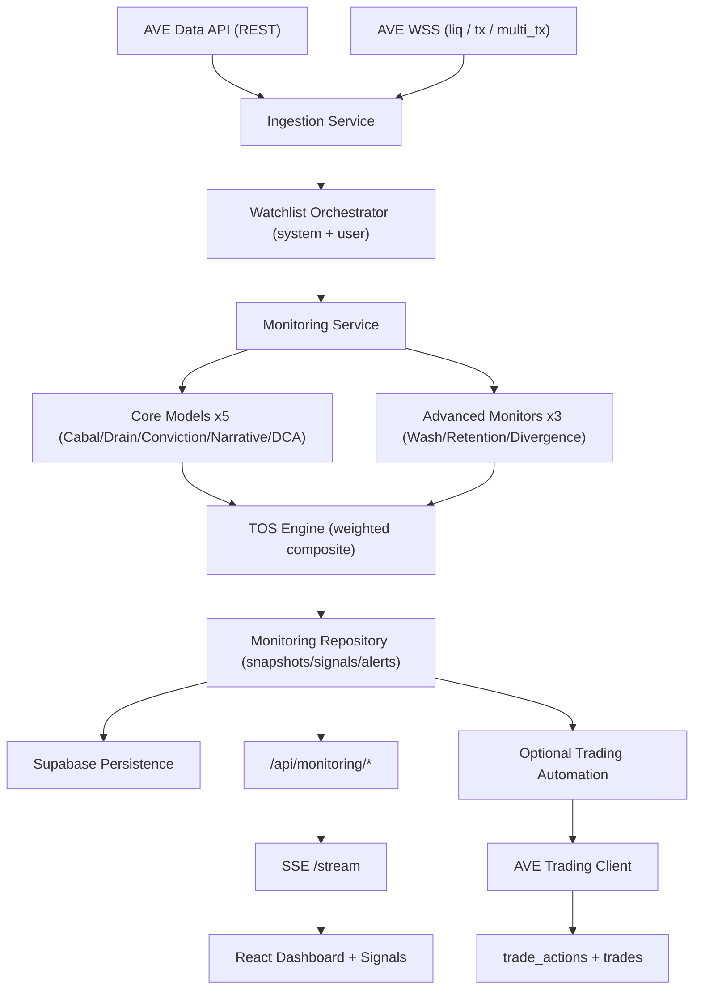

# 项目说明文档（含使用的 AVE Skill 说明）
# Project Documentation (Including Description of AVE Skills Used)

## OPIS — On-Chain Predator Intelligence System

Version: `v1.0`  
Last Updated: `2026-04-14`  
Track: `AVE Claw Hackathon 2026 - Complete Application (Monitoring-first + Optional Trading)`  
Primary Product Focus: `Monitoring Skill`

---

## 1. Executive Summary

OPIS is a production-style, realtime on-chain monitoring platform built on AVE Claw capabilities. The system continuously ingests AVE Data API + AVE WSS event streams, runs a multi-model quant engine (5 core models + 3 advanced monitors), computes a composite TOS (Threat + Opportunity Score), and pushes actionable signals/alerts to a live dashboard and signal intelligence UI.  

The product is monitoring-first by design:

- It prioritizes continuous detection of manipulation, risk, and opportunity.
- It delivers explainable model-by-model scores, not opaque black-box outputs.
- It supports optional signal-to-execution via AVE Trading Skill endpoints, but execution is intentionally a secondary connector.

In short: OPIS converts noisy raw on-chain events into structured, score-driven, realtime intelligence.

---

## 2. Hackathon Positioning

### 2.1 Selected Track Fit

This implementation fits the **Complete Application** track:

- Monitoring Skill: fully implemented and primary.
- Trading Skill: integrated as optional execution path.

### 2.2 Judging Alignment

- Innovation (30%): 8-model quant stack + TOS composite + WSS-triggered selective invalidation.
- Technical Execution (30%): modular feature-domain architecture, typed contracts, realtime pipeline, persistence, tests.
- Real-World Value (40%): watchlist-centric signal operations, risk/opportunity ranking, persistent alerts/signals/actions.

---

## 3. AVE Skill Integration Matrix

## 3.1 Monitoring Skill (Primary)

| OPIS Component | AVE Capability | Usage |
|---|---|---|
| Watchlist market discovery | `GET /v2/tokens/trending`, `GET /v2/tokens/platform`, `GET /v2/tokens` | Build and refresh system token universe + searchable token catalog |
| Token/contract enrichment | `GET /v2/tokens/{tokenId}`, `GET /v2/contracts/{tokenId}` | Creator address, risk score, token metadata, pair metadata |
| Holder/network behavior | `GET /v2/tokens/top100/{tokenId}`, `GET /v2/address/tx` | Cabal graph, wash loops, retention cohorts, smart-wallet behavior |
| Smart wallet quality | `GET /v2/address/smart_wallet/list`, `GET /v2/address/pnl` | Conviction/DCA scoring for informed opportunity signals |
| Price + liquidity internals | `GET /v2/klines/token/{tokenId}`, `GET /v2/txs/liq/{pairId}` | Divergence and drain pressure analytics |
| Realtime event ingestion | WSS topics `liq`, `tx`, `multi_tx` | Event-driven module invalidation, low-latency signal refresh |

## 3.2 Trading Skill (Optional Connector)

| OPIS Trading Step | AVE Bot API Endpoint | Purpose |
|---|---|---|
| Quote | `POST /v1/thirdParty/chainWallet/getAmountOut` | Estimate out amount before execution |
| Place order | `POST /v1/thirdParty/tx/sendSwapOrder` | Submit swap order from delegate wallet |
| Status polling | `GET /v1/thirdParty/tx/getSwapOrder` | Track lifecycle: generated/waiting/sent/confirmed/error |
| Delegate wallet create | `POST /v1/thirdParty/user/generateWallet` | Provision proxy wallet (`assetsId`) |
| Delegate wallet verify | `GET /v1/thirdParty/user/getUserByAssetsId` | Validate wallet and addresses before trading |

All signed delegate calls use HMAC (`AVE-ACCESS-SIGN`, `AVE-ACCESS-TIMESTAMP`) generated from `AVE_BOT_API_SECRET`.

---

## 4. System Architecture



## 4.1 Backend Domain Layout

```text
backend/src/
  features/
    ingestion/       # WSS manager + subscription routing + event scheduler
    monitoring/      # 8 quant modules, TOS, strategy, signal/alert mapping
    trading/         # optional signal->execution path + risk gates
    persistence/     # Supabase repositories
  shared/
    clients/         # AVE data, AVE trading, Supabase REST clients
    config/          # centralized env loader
    constants/       # chain definitions
    errors/          # AppError + centralized middleware
    container/       # dependency wiring
```

## 4.2 Frontend Domain Layout

```text
src/
  pages/
    Dashboard.tsx    # watchlist control + live TOS feed + alert stream
    Signals.tsx      # model signals + filters + signal-level execution controls
    Trading.tsx      # optional action queue + execution history
  features/
    monitoring/      # APIs, hooks, types, SSE stream sync
    trading/         # APIs, hooks, types
```

---

## 5. Realtime Data Plane

## 5.1 WSS Topics Used

- `liq` -> liquidity events per pair
- `tx` -> swap/transaction stream per pair
- `multi_tx` -> token-address-linked transaction stream

For each watchlist token, backend subscribes to:

- `liq(mainPair, chain)`
- `tx(mainPair, chain)`
- `multi_tx(tokenAddress, chain)`

## 5.2 Event-Gated Reanalysis

WSS events do not trigger full heavy recomputation every tick. OPIS uses per-topic cooldown + in-flight gating + pending queue:

- `liq` cooldown: `30s`
- `tx` cooldown: `120s`
- `multi_tx` cooldown: `45s`

Invalidated module set by topic:

- `wss_liq` -> `drain`, `divergence`
- `wss_tx` -> `drain`, `divergence`
- `wss_multi_tx` -> `drain`, `dca`, `conviction`, `divergence`

Additionally, event-driven full model refresh runs at most once every `5m`.

## 5.3 Polling Mode

- If `MONITORING_POLL_INTERVAL_MS > 0`: scheduled watchlist cycle is enabled.
- If `MONITORING_POLL_INTERVAL_MS = 0` (recommended realtime mode): no periodic poll loop; WSS-driven refresh remains active.

## 5.4 Module Cache TTL Registry

To avoid over-querying AVE endpoints while preserving responsiveness, module outputs are cached per token/module:

| Module | TTL |
|---|---|
| cabal | `60m` |
| drain | `1m` |
| conviction | `120m` |
| narrative | `5m` |
| dca | `120m` |
| wash | `5m` |
| retention | `12h` |
| divergence | `3m` |

WSS triggers invalidate selected modules before recomputation.

## 5.5 Watchlist Refresh Cadence

- System watchlist hard refresh interval: `5m`
- Event-driven full model refresh cooldown: `5m`
- Curated + trending blending with chain balancing and dedupe

---

## 6. Quant Engine Specification

OPIS exposes 8 independent model outputs per token and one composite TOS.

Severity domain:

- `info`
- `warning`
- `high`
- `critical`
- `opportunity`

---

## 6.1 Core Model #1 — Cabal Fingerprinter

Goal: detect coordinated holder clusters.

### Data Inputs

- `top100 holders`: `/v2/tokens/top100/{tokenId}`
- `holder tx history`: `/v2/address/tx`

### Feature Extraction

For each holder sample:

- `balanceRatio`
- `firstBuyTime`
- `firstSender`

Wallet enters coordinated cluster if:

- within launch timing band (`|firstBuyTime - median| <= 600s`), or
- shares common funder (`sender frequency > 1`), or
- high concentration holder (`balanceRatio >= 1%`).

### Scoring

```text
clusterSizeRatio = coordinatedCount / sampleCount
supplyRatio = clamp(clusterSupplyPct / 100, 0, 1)
timingBonus = 20 if avgDeltaSeconds in (0, 600) else 0
funderBonus = 10 if sharedFunders > 0 else 0

CabalScore = clamp(clusterSizeRatio*40 + supplyRatio*30 + timingBonus + funderBonus, 0, 100)
```

### Severity Logic

- `critical` if `score > 65` and `clusterSupplyPct > 15`
- `high` if `score > 45` and `clusterSupplyPct > 8`
- else `info`

---

## 6.2 Core Model #2 — DEV Drain Velocity

Goal: detect incremental liquidity drain/rug patterns.

### Data Inputs

- `liquidity tx`: `/v2/txs/liq/{pairId}`
- `creator tx behavior`: `/v2/address/tx` (creator wallet)
- metadata: token age, TVL, AVE risk score

### Window Stats

Compute in `1h` and `4h` windows:

- remove event count
- net drain ratio
- dev removal ratio
- removed USD

Window score:

```text
netDrainPct = removed / (added + removed)
devRatio = devRemoved / max(totalRemoved, 1)
freqScore = min(removeCount / 10, 1)

WindowScore = clamp(netDrainPct*40 + devRatio*35 + freqScore*25, 0, 100)
```

Dynamic threshold:

```text
threshold = 50
if tokenAgeHours < 24 -> threshold -= 15
if tvlUsd > 500000 -> threshold += 10
if aveRiskScore > 60 -> threshold -= 10
threshold = max(threshold, 25)
```

DEV sell bonus (4h):

```text
devSellBonus = min(15, sellCount*5)
DrainScore = clamp(max(oneHourScore, fourHourScore) + devSellBonus, 0, 100)
```

### Severity Logic

- `critical` if `score >= threshold + 20`
- `high` if `score >= threshold`
- `warning` if `score >= threshold - 10`
- else `info`

---

## 6.3 Core Model #3 — Conviction Stack

Goal: identify meaningful smart-money alignment (not single wallet noise).

### Data Inputs

- smart wallets: `/v2/address/smart_wallet/list`
- per wallet pnl: `/v2/address/pnl`
- per wallet tx history: `/v2/address/tx`
- token klines: `/v2/klines/token/{tokenId}`

### Wallet-Level Features

- buy frequency score
- average buy size vs wallet USD balance
- hold duration
- held-through-drawdown (+10)
- DCA variance score (price dispersion of buy ladder)

Wallet score:

```text
freqScore = min(buyCount/5, 1) * 25
sizeScore = clamp(avgBuyUsd / walletBalanceUsd, 0, 1) * 25
holdScore = min(holdHours/48, 1) * 15 + drawdownHoldBonus
dcaScore = min(priceVariance*100, 25)

WalletConviction = freqScore + sizeScore + holdScore + dcaScore
```

Stack score:

```text
average = mean(meaningfulWalletScores where score > 20)
walletCountFactor = min(walletCount / 10, 1)
ConvictionScore = clamp(average*0.6 + walletCountFactor*100*0.4, 0, 100)
```

### Severity Logic

- `opportunity` if `score > 80`
- `high` if `score > 65`
- else `info`

---

## 6.4 Core Model #4 — Narrative Radar

Goal: detect narrative acceleration and rotation opportunities.

### Data Inputs

- trending by chain: `/v2/tokens/trending` for `solana`, `bsc`, `eth`
- internal narrative history cache (current + previous snapshot)

### Narrative Classification

Token name/symbol matched against keyword map (`narrative-keywords.ts`), output narrative buckets (e.g. AI, meme subclasses).

### Scoring

For each narrative and chain:

```text
acceleration = (currentVolume24h - previousVolume24h) / max(previousVolume24h, 1)
```

For target token narrative:

- `targetAcceleration`: same chain acceleration
- `sourceAcceleration`: max acceleration from other chains

```text
rotationScore = 70 + clamp(sourceAcceleration*30, 0, 20)
  if sourceAcceleration > 0.3 and targetAcceleration < 0.1
  else 0

localMomentumScore = clamp(targetAcceleration*100, 0, 100)
NarrativeScore = max(rotationScore, localMomentumScore)
```

### Severity Logic

- `opportunity` >= 70
- `high` >= 45
- `warning` >= 25
- else `info`

Note: Narrative model is chain-enabled for `solana/bsc/eth`; `base` receives fallback info module.

---

## 6.5 Core Model #5 — Smart Wallet DCA Accumulation

Goal: detect repeated dip-buy accumulation cadence.

### Data Inputs

- smart wallet list: `/v2/address/smart_wallet/list`
- wallet tx history: `/v2/address/tx`

### Wallet DCA Profile

- buy count
- average interval (minutes)
- interval stability (coefficient of variation)
- dip-buy ratio (buy[i] <= 0.98 * buy[i-1])
- net accumulation bias (buys > sells)

```text
freqScore = min(buyCount/6, 1)*30
dipScore = dipRatio*35
cadenceScore = (1 - clamp(cadenceVariation, 0, 1))*20
netAccumScore = 15 if sells < buys else 0

WalletDcaScore = clamp(freqScore + dipScore + cadenceScore + netAccumScore, 0, 100)
```

Aggregate:

```text
averageScore = mean(activeProfiles where score >= 20)
countFactor = min(activeCount/8, 1)*25
DcaScore = clamp(averageScore*0.75 + countFactor, 0, 100)
```

### Severity Logic

- `opportunity` if `score >= 80`
- `high` if `score >= 60`
- `warning` if `score >= 40`
- else `info`

---

## 6.6 Advanced Monitor #1 — Wash Trading Detector

Goal: detect synthetic flow loops among concentrated holders.

### Data Inputs

- top holders: `/v2/tokens/top100/{tokenId}`
- holder tx history (24h): `/v2/address/tx`

### Features

- internal holder-to-holder transfer edges
- reciprocal edge loops (`A->B` and `B->A`)
- holder concentration
- activity factor

```text
washRatio = internalFlows / max(tradeEvents, 1)
loopRatio = reciprocalLoops / max(uniqueInternalFlows, 1)
concentrationRatio = clamp(holderBalanceSum/100, 0, 1)
activityFactor = clamp(tradeEvents/24, 0, 1)

WashScore = clamp(washRatio*120 + loopRatio*30 + concentrationRatio*15 + activityFactor*10, 0, 100)
```

Guardrail: if activity events `< 8`, model outputs low-confidence info.

### Severity Logic

- `critical` >= 75
- `high` >= 60
- `warning` >= 40
- else `info`

---

## 6.7 Advanced Monitor #2 — Holder Retention Tracker

Goal: compare early holder retention vs age-adjusted benchmark.

### Data Inputs

- top holders sample
- holder tx histories
- token age

### Benchmarks

- age <= 7d -> benchmark `35%`
- <= 14d -> `25%`
- <= 30d -> `20%`
- > 30d -> `15%`

Model waits until token age >= 24h.

```text
retentionPct = retainedCohort / cohortSize
holdFactor = clamp(mean(retainedHoldHours) / max(tokenAgeHours, 24), 0, 1)
cohortCoverage = clamp(cohortSize/MAX_HOLDER_SAMPLE, 0, 1)

RetentionScore = clamp((retentionPct/benchmark)*55 + holdFactor*25 + cohortCoverage*20, 0, 100)
```

### Severity Logic

- `opportunity` >= 80
- `high` >= 65
- `warning` >= 45
- else `info`

---

## 6.8 Advanced Monitor #3 — Momentum Divergence Monitor

Goal: detect bullish price leg with weakening internals.

### Data Inputs

- klines: `/v2/klines/token/{tokenId}`
- smart wallets + tx histories
- liquidity add/remove stream

### Features

- price momentum % over lookback
- smart-wallet sell pressure (sell/(buy+sell))
- LP removal pressure (removed/(added+removed))

```text
if priceMomentumPct <= 0:
  score = 0
else:
  momentumFactor = clamp((priceMomentumPct - 1.5)/22, 0, 1)
  internalStress = clamp(sellPressure*0.6 + lpRemovalRatio*0.4, 0, 1)
  DivergenceScore = clamp(momentumFactor * internalStress * 130, 0, 100)
```

### Severity Logic

- `critical` >= 75
- `high` >= 60
- `warning` >= 40
- else `info`

---

## 6.9 Quant Runtime Parameter Notes

Selected hard parameters currently used in production code:

- `MAX_HOLDERS_FOR_CABAL_SCAN = 6`
- `MAX_SMART_WALLETS_FOR_CONVICTION_SCAN = 2`
- wash holder sample size = `4`
- retention holder sample size = `4`
- divergence smart wallet sample size = `1`

These defaults intentionally favor deterministic, low-latency realtime behavior under API rate and compute constraints. They can be tuned upward for higher-depth offline analysis.

---

## 7. Composite TOS Engine

TOS uses core model weights:

```text
TOS =
  cabal*0.25 +
  drain*0.20 +
  conviction*0.25 +
  narrative*0.15 +
  dca*0.15
```

Zones:

- `< 30` -> `safe`
- `< 60` -> `watch`
- `>= 60` -> `act`

Polarity:

```text
threatScore = cabal + drain
opportunityScore = conviction + narrative + dca
polarity = threatScore >= opportunityScore ? "threat" : "opportunity"
```

---

## 8. Strategy Derivation Layer

Per snapshot strategy mode:

1. `DEFENSIVE_EXIT`  
if `max(cabal, drain, wash, divergence) >= 70`

2. `DCA_ACCUMULATION`  
if `dca >= 65` and `conviction >= 60`

3. `OPPORTUNITY_ENTRY`  
if `tos >= 60` and `conviction >= 55` and `retention >= 55`

4. `MONITOR`  
otherwise

This strategy field is displayed directly in Dashboard and propagated to alerts/actions.

---

## 9. Signal and Alert Generation

Each snapshot produces:

- 9 signals (`8 modules + tos`)
- conditional alerts based on per-module thresholds + TOS threshold

Module alert thresholds:

- cabal: `>=45`
- drain: `>=45`
- conviction: `>=50`
- narrative: `>=45`
- dca: `>=45`
- wash: `>=40`
- retention: `>=55`
- divergence: `>=45`

TOS alert generated when `tos.score >= 55`.

Signal ordering logic in API:

1. user watchlist tokens pinned first
2. severity rank (`critical > high > warning > opportunity > info`)
3. latest timestamp
4. score

---

## 10. Watchlist Engine

## 10.1 System Watchlist

Built from:

- curated seed basket (major active tokens across Solana/BSC/ETH)
- trending token candidates by chain
- blend of momentum (`volume24h`) and liquidity (`mainPairTVL`)
- maturity and minimum TVL filters

Balanced chain selection then deduped and limited by `WATCHLIST_LIMIT` (default `12`).

## 10.2 User Watchlist

Per-user watchlist persisted in Supabase (`user_watchlist`), merged with system watchlist at runtime.

Token config options:

- `executionMode`: `trade` or `delegate_exit`
- `assetsId`
- `buyAmountAtomic`
- `sellAmountAtomic`

Frontend includes explicit **Save** button and status badge (`Saved`, `Unsaved`, `Saving`, `Save Failed`).

## 10.3 Stale Data Pruning

When watchlist changes, backend prunes:

- out-of-watchlist snapshots
- out-of-watchlist signals/alerts
- out-of-watchlist module cache entries

This keeps dashboard/signal pages aligned with active universe only.

---

## 11. Frontend Realtime Behavior

## 11.1 Transport

- Frontend opens `EventSource` to `/api/monitoring/stream`.
- Backend SSE payload includes both:
  - `overview` (snapshots + alerts)
  - `signals`

No frontend polling loop is required for signal/overview freshness. EventSource auto-reconnect is used on disconnect.

## 11.2 Query Synchronization

On each SSE message:

- `monitoring/overview` cache updated
- `monitoring/signals` cache updated
- lightweight invalidation (cooldown `1.5s`) for:
  - watchlist query
  - trading actions
  - trade history

## 11.3 User Experience Surfaces

- Dashboard:
  - watchlist search/add with chain filter
  - token execution configuration + explicit save
  - live TOS table including all 8 module columns
  - live alert stream
- Signals:
  - module/category/priority/sort filters
  - pinned watchlist signals on top
  - per-signal metrics + full model scoreboard tiles

---

## 12. Persistence and Retention Design

Supabase tables:

- `user_watchlist`
- `monitoring_signals`
- `monitoring_alerts`
- `trade_actions`
- `trades`

Schema file: `backend/sql/supabase-schema.sql`

## 12.1 Data Retention Policy (30-row cap)

Implemented in SQL trigger function `prune_recent_rows()`:

- `monitoring_signals`: keep newest 30 global rows
- `monitoring_alerts`: keep newest 30 global rows
- `user_watchlist`: keep newest 30 rows per `user_id`
- `trade_actions`: keep newest 30 rows per `user_id`
- `trades`: keep newest 30 rows per `user_id`

This policy enforces bounded storage for demo/hackathon operation and keeps UIs focused on recent state.

---

## 13. Optional Trading Connector (Monitoring-Compatible)

Even though monitoring is primary, the execution path is integrated and fully typed.

## 13.1 Risk Gate Thresholds

- Threat exit trigger: `TOS >= 65`
- Opportunity buy trigger: `TOS >= 60`

## 13.2 Execution Flow

1. signal/action created (`trade_actions`)
2. quote request
3. order submit (`sendSwapOrder`)
4. status polling (`max 4 polls`, `2s` interval)
5. trade status persisted (`trades`)

For `delegate_exit` mode on threat snapshots, auto execution can run immediately.

---

## 14. API Surface

## 14.1 Monitoring API

- `GET /api/monitoring/overview`
- `GET /api/monitoring/stream` (SSE)
- `GET /api/monitoring/signals`
- `GET /api/monitoring/alerts`
- `GET /api/monitoring/watchlist`
- `POST /api/monitoring/watchlist`
- `GET /api/monitoring/tokens`
- `POST /api/monitoring/analyze`
- `POST /api/monitoring/run-cycle`

## 14.2 Trading API (Optional)

- `POST /api/trading/quote`
- `POST /api/trading/orders`
- `GET /api/trading/orders/:orderId`
- `POST /api/trading/delegate-wallets`
- `GET /api/trading/delegate-wallets/:assetsId`
- `GET /api/trading/actions`
- `POST /api/trading/actions/:actionId/execute`
- `POST /api/trading/actions/:actionId/dismiss`
- `POST /api/trading/signal-execute`
- `GET /api/trading/trades`

---

## 15. Operational Resilience

## 15.1 AVE Data Client Controls

- Request timeout: `12s`
- Retry count: `2`
- Retryable statuses: `408, 425, 429, 500, 502, 503, 504`
- Layered TTL caches:
  - trending `20s`
  - token details `60s`
  - contracts `24h`
  - smart wallets `6h`
  - klines `10m`
  - top holders `120s`
  - address tx `30s`
  - address pnl `45s`
  - liquidity tx `30s`

## 15.2 WSS Reliability

- heartbeat ping every `30s`
- exponential reconnect backoff up to `30s`
- subscription registry and replay on reconnect
- event count / last-message telemetry via manager status

## 15.3 Persistence Safety

- Monitoring persistence suspends writes for `60s` on repeated failures to avoid failure storms.
- Centralized `AppError` + error middleware for stable API error envelopes.

---

## 16. Security and Secrets

Required secrets are loaded centrally from env (`backend/src/shared/config/env.ts`):

- `AVE_DATA_API_KEY`
- `AVE_BOT_API_KEY`
- `AVE_BOT_API_SECRET` (required for signed delegate calls)
- `SUPABASE_*` credentials

No hardcoded API credentials are stored in code.

---

## 17. Test Coverage

Existing automated tests include:

- `MonitoringService` behavior:
  - snapshot listener dispatch with user watchlist context
  - user-token signal pinning
- `RiskGateService`:
  - threat exit decision
  - opportunity buy decision
  - below-threshold null decision
- `TradingService`:
  - delegate-exit auto execution path from monitoring snapshot

Run:

```bash
npm run test
npm run typecheck:backend
npx tsc -p tsconfig.app.json --noEmit
```

---

## 18. Deployment Runbook

## 18.1 Environment

Core:

```env
PORT=4090
CORS_ORIGIN=http://localhost:8080
AVE_DATA_BASE_URL=https://prod.ave-api.com
AVE_DATA_API_KEY=...
AVE_WSS_URL=wss://wss.ave-api.xyz
ENABLE_WSS_INGESTION=true
MONITORING_POLL_INTERVAL_MS=0
WATCHLIST_LIMIT=12
```

Optional persistence/trading:

```env
SUPABASE_URL=...
SUPABASE_SERVICE_ROLE_KEY=...
AVE_BOT_BASE_URL=https://bot-api.ave.ai
AVE_BOT_API_KEY=...
AVE_BOT_API_SECRET=...
```

Frontend:

```env
VITE_MONITORING_API_URL=http://localhost:4090/api/monitoring
VITE_TRADING_API_URL=http://localhost:4090/api/trading
```

## 18.2 Start Commands

```bash
npm install
npm run server:dev
npm run dev
```

Health check:

```bash
curl -sS http://localhost:4090/health
```

---

## 19. End-to-End User Flow (Frontend)

1. Open Dashboard.
2. Expand `Search & Add Tokens`.
3. Filter by chain, search by symbol/name/address.
4. Add token to custom watchlist.
5. Set execution fields (`assetsId`, mode, amounts).
6. Click **Save** on token config (Saved badge appears).
7. Observe realtime updates in:
   - Live TOS Feed (all model columns)
   - Alert Stream
   - Signals page (pinned watchlist first)
8. Optional: execute buy/sell from signal card or trading queue.

All watchlist and config changes persist to Supabase when configured.

---

## 20. Why This Is Quant-Grade Monitoring

OPIS is not a single-indicator dashboard. It is a layered quant pipeline:

- multi-domain feature extraction (holders, liquidity, wallet behavior, narrative flow, price internals)
- cross-model scoring with explicit weights and thresholds
- event-driven invalidation to maintain low-latency signal freshness
- explainable output with per-model metrics and full scoreboard visibility
- deterministic persistence and retention policies for reliable operational UX

This gives operators actionable, explainable, and continuous on-chain intelligence rather than static snapshot analytics.

---

## 21. Current Scope and Planned Enhancements

Current scope is production-oriented for hackathon timelines, but extensible:

- Current:
  - 8 models + composite TOS
  - realtime WSS ingestion + SSE delivery
  - watchlist-driven personalization
  - optional AVE trading connector
- Next:
  - historical backtest dataset generation per model
  - per-chain adaptive weight optimizer for TOS
  - richer graph analytics for multi-hop wallet flow
  - model calibration dashboard and confidence drift monitoring

---

## 22. Submission Notes (PDF Upload)

The hackathon form asks for a PDF; this markdown file is the master source.

Recommended conversion:

1. Open this file in VS Code.
2. Use Markdown PDF export extension or print-to-PDF.
3. Keep filename as: `OPIS_Project_Documentation_AVE_Claw_2026.pdf`

---

## 23. Repository Reference

Primary docs:

- `README.md`
- `docs/PROJECT_DOCUMENTATION_AVE_CLAW_2026.md` (this file)
- `backend/sql/supabase-schema.sql`

Primary runtime entry points:

- Backend: `backend/src/index.ts`
- Frontend app root: `src/App.tsx`
